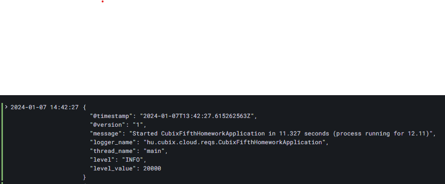
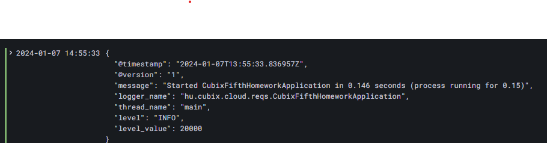
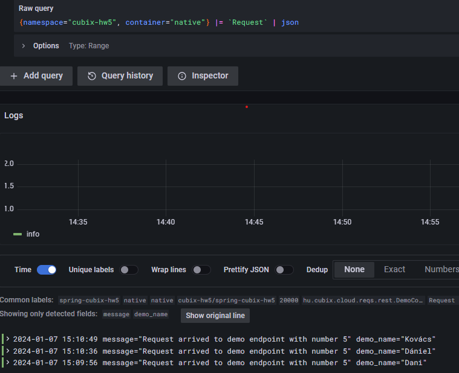
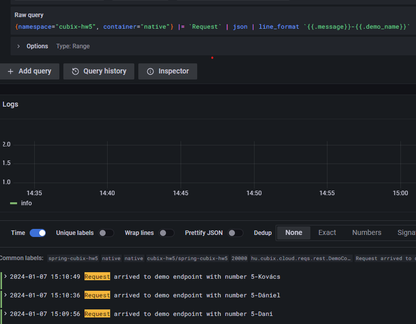

create namespace:

```
kubectl create namespace cubix-hw5
```

***jvm-based app:***

```
helm install jvm spring-cubix-hw5 -f jvm.yaml  -n cubix-hw5
```

Grafana logs:

```
Raw query
{namespace="cubix-hw5", container="jvm"} |= ``
```

releváns sor:
```json
2024-01-07 14:42:27	
{"@timestamp":"2024-01-07T13:42:27.615262563Z","@version":"1","message":"Started CubixFifthHomeworkApplication in 11.327 seconds (process running for 12.11)","logger_name":"hu.cubix.cloud.reqs.CubixFifthHomeworkApplication","thread_name":"main","level":"INFO","level_value":20000}
```
jvm alapú megoldás elvátolítása:
```
helm delete jvm -n cubix-hw5
```

***native-app:***

```
helm install native spring-cubix-hw5 -f native.yaml  -n cubix-hw5
```

Grafana logs:
```text
Raw query
{namespace="cubix-hw5", container="native"} |= ``
```

releváns sor:
```json
2024-01-07 14:55:33	
{"@timestamp":"2024-01-07T13:55:33.836957Z","@version":"1","message":"Started CubixFifthHomeworkApplication in 0.146 seconds (process running for 0.15)","logger_name":"hu.cubix.cloud.reqs.CubixFifthHomeworkApplication","thread_name":"main","level":"INFO","level_value":20000}
```
A gyorsabb startup miatt a **native** megközelítést választom.


## Csak Reuquest-et tartalmazó sorok logolása:

Raw query
{namespace="cubix-hw5", container="native"} |= `Request` | json



Line filterrel kiegészítve:
Raw query
{namespace="cubix-hw5", container="native"} |= `Request` | json | line_format `{{.message}}-{{.demo_name}}`



## Healthcheck betökése:
```
helm upgrade native spring-cubix-hw5 --install -f native.yaml  -n cubix-hw5
```

Utána pod-ok vizsgálata:
```
kubectl get pods -w -n cubix-hw5
```

```
NAME                                       READY   STATUS    RESTARTS   AGE
native-spring-cubix-hw5-789f76f486-xb6d7   1/1     Running   0          17m
```
